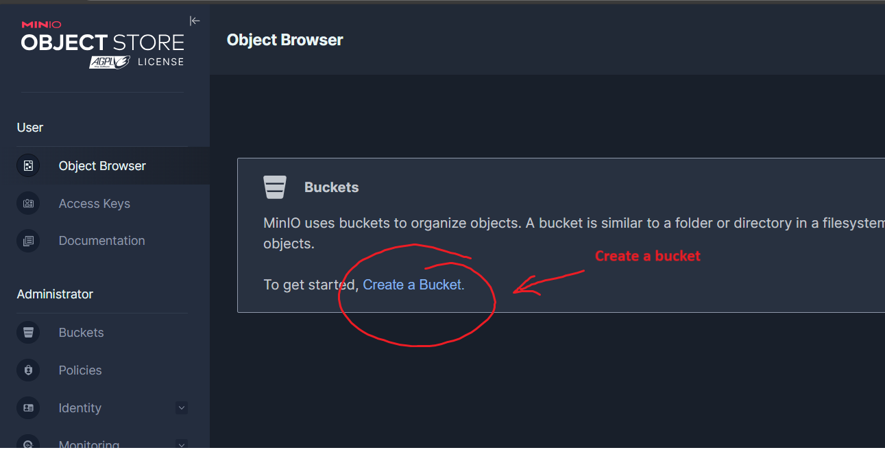
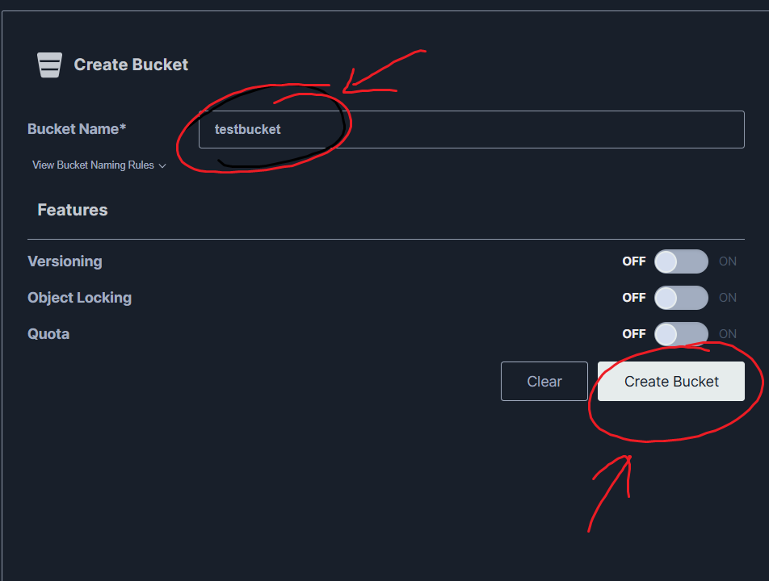
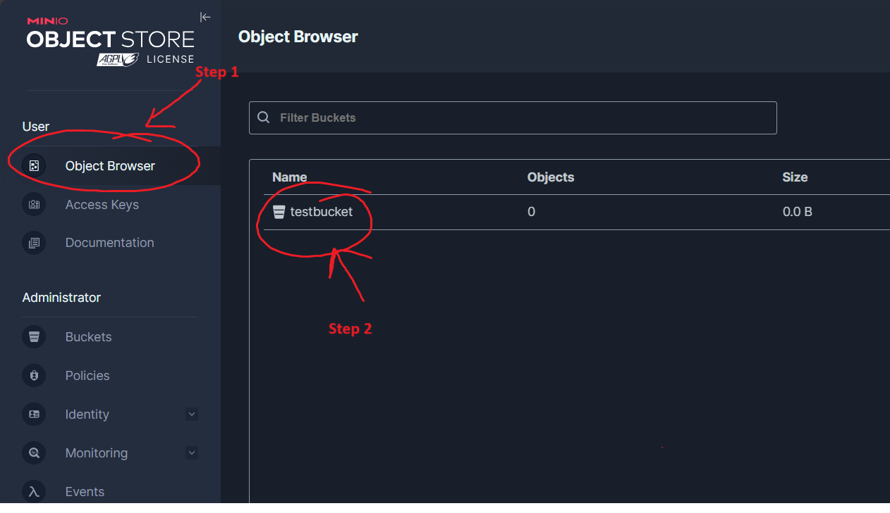
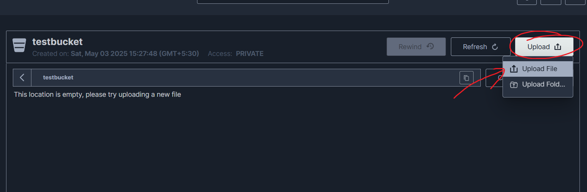
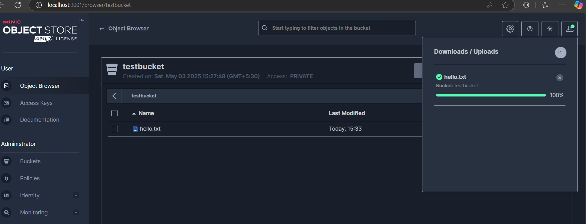
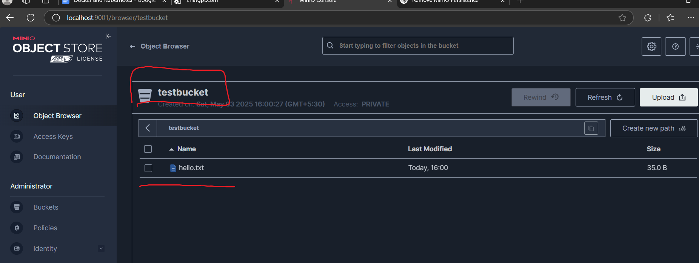

# ✅ Lab 6: Deploying MinIO as a Deployment with Persistent Volume in Kubernetes

🕒 **Time:** 25 mins

## 🧾 Lab Summary
In this  lab, participants will deploy MinIO as a Deployment in Kubernetes using Persistent Volumes (PVs) via an existing Storage Class to ensure data persistence. Although Deployments typically manage stateless applications, attaching a Persistent Volume enables MinIO to retain its state.
---

## 🎯 Objectives
- Create a Persistent Volume Claim using the existing Storage Class.
- Deploy MinIO as a Deployment.
- Expose MinIO using a Service.
- Test persistent volume by uploading a file.
- Clean up all resources.

---

## 🛠️ Step-by-Step Instructions

## ☘️ Pre-requiste : Verify Cluster
1. Make sure your minikube cluster is running 

```bash
kubectl get nodes
```
You should see a node with the status `Ready`.

2. If above step failed, then start Minikube with 4 CPUs and 8GB of memory:

```bash
minikube start --cpus=4 --memory=8192
```

## ☘️ Cleanup 📦🧰🔍
```bash
kubectl delete --all deployment
kubectl delete --all replicaset
kubectl delete --all pod
kubectl delete svc minio-service
```


## ☘️ Step 1: Inspect Available Storage Classes 📦🧰🔍

```bash
kubectl get storageclass
```

Explanation here -->

- `PROVISIONER`: k8s.io/minikube-hostpath – uses the local hostPath provisioner suitable for Minikube (not suitable for multi-node clusters).
- `RECLAIMPOLICY`: Delete – when a PVC is deleted, the corresponding PV is also deleted.
- `VOLUMEBINDINGMODE`: Immediate – the PV is bound to the PVC as soon as it is created, regardless of Pod scheduling.
- `ALLOWVOLUMEEXPANSION`: false – you cannot increase the size of an existing PVC using this StorageClass.

---

## ☘️ Step 2: Explore Persistent Volume Claim (PVC)

In Lab6, you have been provided with `minio_pvc.yaml` file. Explore that file 

### YAML: `minio_pvc.yaml`
```yaml
apiVersion: v1
kind: PersistentVolumeClaim
metadata:
  name: minio-pvc
spec:
  accessModes:
    - ReadWriteOnce
  resources:
    requests:
      storage: 1Gi
  storageClassName: standard
```

This YAML defines a PersistentVolumeClaim named minio-pvc that requests 1Gi of storage with ReadWriteOnce access mode, allowing it to be mounted as read-write by a single node. It uses the standard StorageClass to dynamically provision the volume.

### Apply the PVC:
Let's create the persistent volume claim
```bash
kubectl apply -f minio_pvc.yaml
```

### Verify the Persistent Volume:
Check for pvc status
```bash
kubectl get pv
```
Did you noticed that a volume is binded to your pvc, which means storage is provided.

> ✅ STATUS should be `Bound`.

---

## ☘️ Step 3: Deploy MinIO as a Deployment

You have been provided with `minio_deployment.yaml` in Lab6.
In this deployment, we have mounted the /data folder inside pod to Persistent volume claim.

### YAML: `minio_deployment.yaml`
```yaml
apiVersion: apps/v1
kind: Deployment
metadata:
  name: minio-deployment
spec:
  replicas: 2
  selector:
    matchLabels:
      app: minio
  template:
    metadata:
      labels:
        app: minio
    spec:
      containers:
      - name: minio
        image: minio/minio:latest
        args:
        - server
        - /data
        env:
        - name: MINIO_ROOT_USER
          value: "admin"
        - name: MINIO_ROOT_PASSWORD
          value: "password"
        ports:
        - containerPort: 9000
          name: minio
        volumeMounts:
        - name: data
          mountPath: /data
      volumes:
      - name: data
        persistentVolumeClaim:
          claimName: minio-pvc
```

### Apply the Deployment:
```bash
kubectl apply -f minio_deployment.yaml
```

### Verify the Deployment:
```bash
kubectl get deployment minio-deployment
```

### Check the Pods:
```bash
kubectl get pods -l app=minio
```

> ✅ Ensure Pods are running. Wait for them to come in running state, before moving to next step

---

## ☘️ Step 4: Expose MinIO Using a Service

You have been provided with `minio_service.yaml` in Lab6 to expose underlying pods to outside world.

### YAML: `minio_service.yaml`
```yaml
apiVersion: v1
kind: Service
metadata:
  name: minio-service
spec:
  selector:
    app: minio
  ports:
  - name: minio-svc
    protocol: TCP
    port: 9000
    targetPort: 9000
  - name: minio-console
    protocol: TCP
    port: 9001
    targetPort: 9001
  type: ClusterIP
```

### Apply the Service:
```bash
kubectl apply -f minio_service.yaml
```

### Verify the Service:
```bash
kubectl get service minio-service
```

### Port Forward to Access MinIO Console:
```bash
kubectl port-forward svc/minio-service 9001
```

Then open browser: [http://localhost:9001](http://localhost:9001)

- Username: `admin`
- Password: `password`

---

## ☘️ Step 5: Test Persistence Volume

1. ## In the MinIO console, click **Create Bucket** 



2. ## Name it `testbucket` and click on create bucket



3. ## Open Object browser and select `testbucket` 



4. ## Click on Upload a file.



5. ## Upload `hello.txt` provided in Lab6 folder.




---

## ☘️ Step 6: Delete all pods

1. Delete pod

```bash
kubectl delete --all pod
```
Since pods are part of deployment, so they will be recreated but will data be still there?

2. Check pod status

```bash
kubectl get pod
```
Once they are in running status, do port-forwarding again

3. Port-forwarding
```bash
kubectl port-forward svc/minio-service 9001
```


## ☘️ Step 7: Check MinIO console
 

`Do you still see your file in testbucket?`





if yes, congratulations your deployment is a persistent deployment.


## ☘️ Step 6: Clean Up Resources

### Delete All Resources:
```bash
kubectl delete -f .
```

## ☘️ Step 6: Clean Up Resources

### Delete All Resources:
```bash
kubectl delete -f .
```

### Verify Cleanup:
```bash
kubectl get all
kubectl get pvc
```

---

## 🧾 Conclusion

Participants have successfully deployed MinIO using Kubernetes Deployments and Persistent Volumes to retain application data. They also simulated a rolling update and observed how minimal downtime is achieved. This lab provides real-world skills for managing stateful applications with Kubernetes.

🎉 **END OF LAB**
